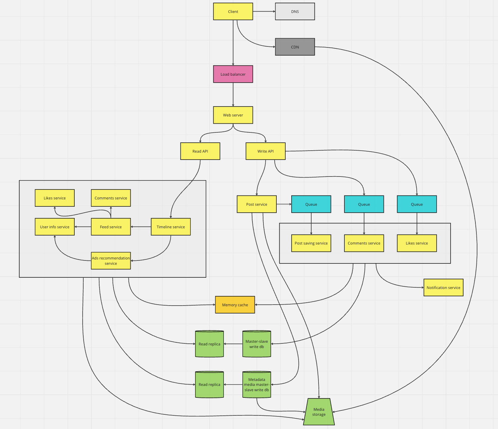

# Instagram architecture

### Use cases

- [User] Fetch personal feed line
- [User] Create/Update post (media: video/photo)
- [User] Create comment to post
- [User] Like/Remove like action

## High level design

*All single boxes display abstraction of multiple services

## Design core components

### Base client interface

Using CQRS pattern to optimize for better scaling

### Write components

- Requests are redirecting to write API
- Post creating/updating 
  - Saving media metadata for post into database
  - Sending request to create post into queue
  - Post saving service should be configured to save batches of request from queues of posts to optimise slow writing
  - Also, posts could be saved into in memory database
- Comments/likes case
  - Requests are redirecting into queues
  - Services responsive to save posted items should make it by batches to optimise slow writing
- Also, all current write operations should trigger notification service

### Read components

Main use case was the timeline (feed)

- Requests are redirecting to read API
- Timeline service - aggregate data from more detailed services
  - Feed service - cover logic of building feed based of user interest [User info service] and fetch specific information about post [Comment and Likes services]
  - Ads recommendation service - cover logic of building ads based of user information [User info service]

## Problems

### Slow saving

Current problem should be solved by queues and saving by batches of data, as far as I understand, perfectly it might cost constant write operation per time unit.

### Slow reading

This problem it should be covered by memory cache storage that cost O(1) on read.

